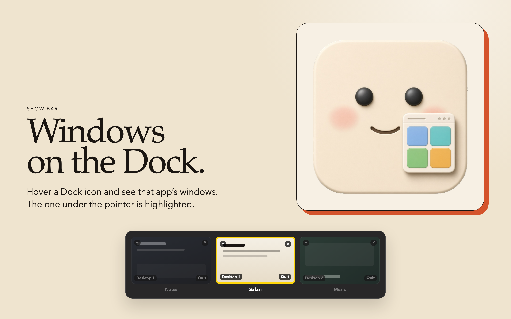
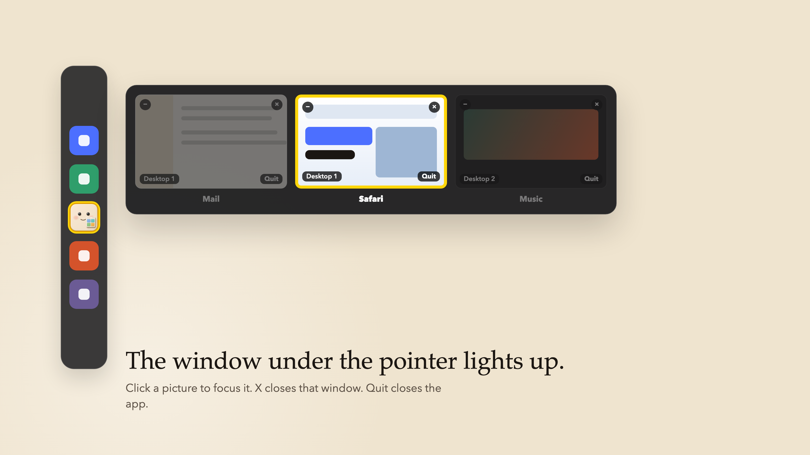
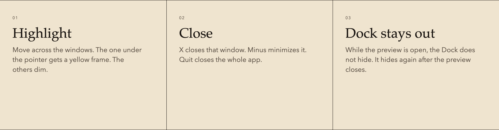

  

<h1 align="center">Show Bar</h1>

Window previews for the Mac Dock. Hover an icon. See the windows. Click the one you want.

  <a href="https://github.com/rept0rix/show-bar/releases/latest"><strong>Download Show Bar</strong></a>

  

Show Bar is a menu-bar app by Naor Yanko. It adds Windows-style previews to the Mac Dock.

  

  

## Download

The latest build is on [GitHub Releases](https://github.com/rept0rix/show-bar/releases/latest).

Show Bar is not on the Mac App Store. Accessibility, Screen Recording, and Dock hover do not fit App Store rules.

This build is signed for development. It opens on the Mac it was built for. Other Macs need a notarized Developer ID build.

## Setup

1. Move `Show Bar.app` into Applications and open it.
2. Turn on Show Bar under Privacy & Security → Accessibility.
3. Turn on Screen Recording so the previews show the pages, not only the names.

Settings opens from the smiley in the menu bar.

## Who

Naor Yanko · na0ryank0@gmail.com
